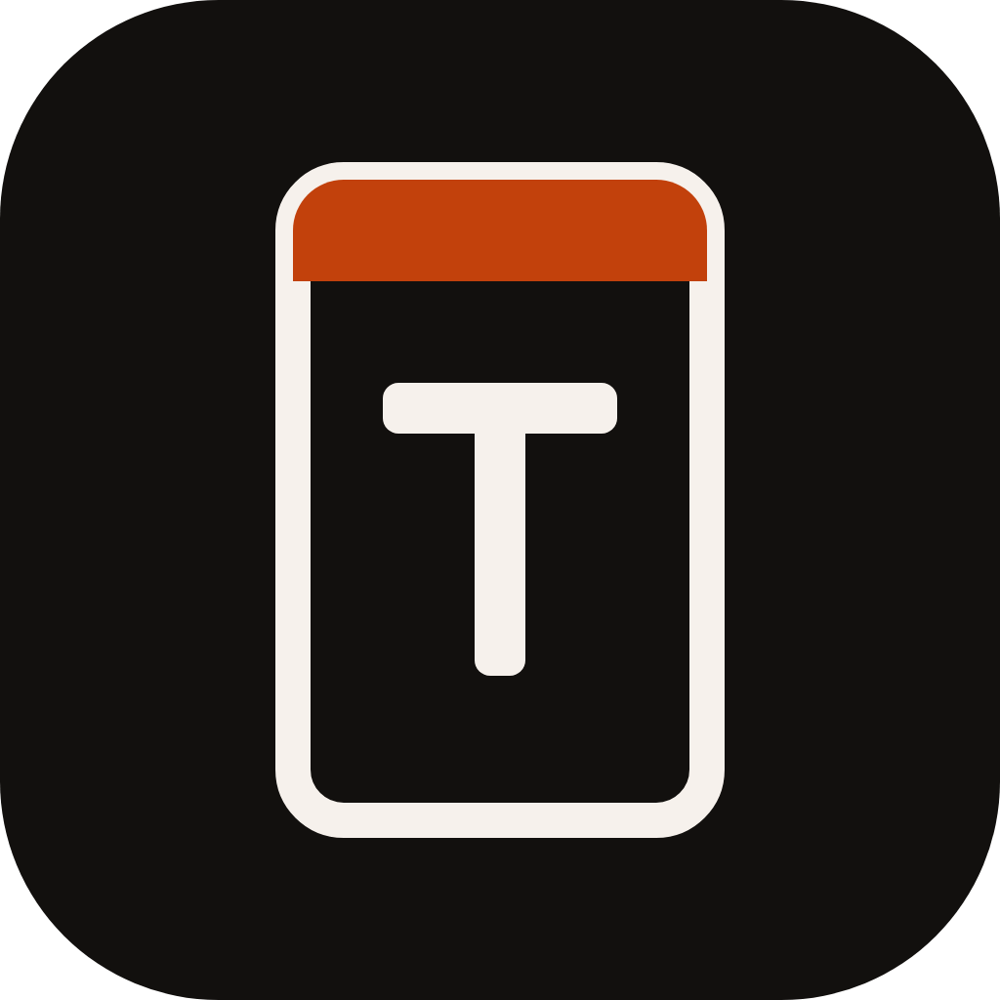
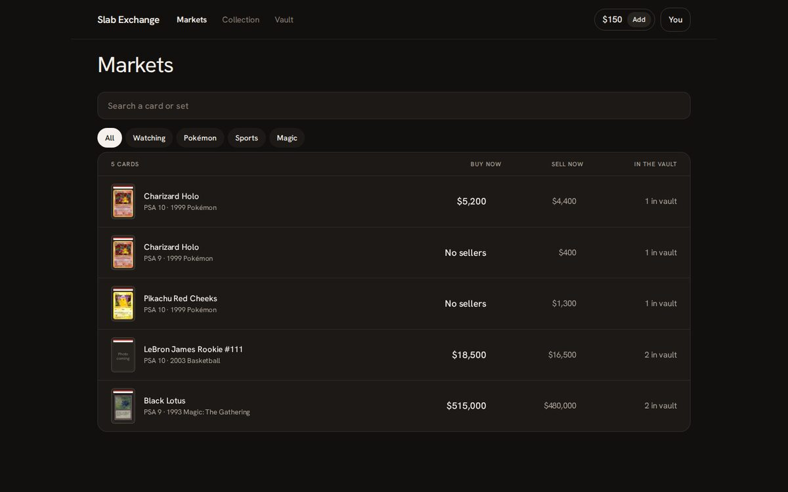
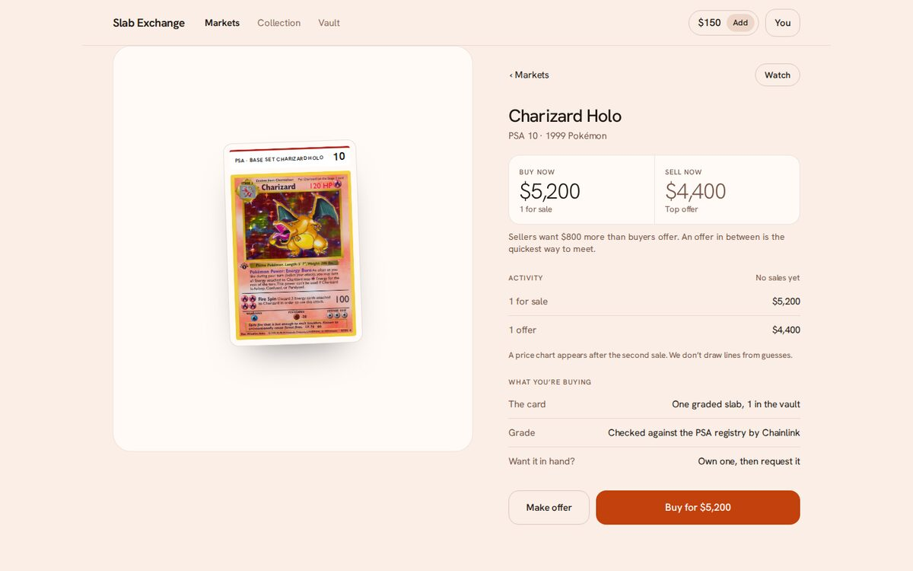
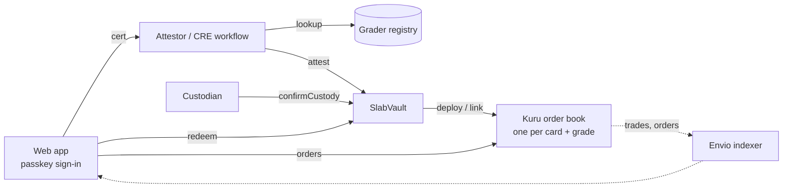

<p align="center">
  
</p>

# Tivan

A market for graded collectible cards on Monad. Each card and grade (for example, PSA 10 Base Set Charizard) is a
whole-unit token backed by a vaulted slab and trades on its own on-chain order book, priced in dollars and settled in
under a second. Holders can redeem the physical slab at any time.

<p>
  
  
</p>

Built for [Monad Metropolis](https://hackathon.monad.xyz). Running on Monad testnet; the mainnet vault is deployed with
demo tokens only. Addresses and transaction hashes are in [docs/DEPLOYMENTS.md](docs/DEPLOYMENTS.md).

## Why

Tokenized card platforms list every slab as a unique NFT. A PSA 10 Charizard with cert 81234567 and one with cert
81234568 are separate listings even though collectors treat them as the same item, so there is no bid for "any PSA 10
Charizard", only asking prices and a wait. Tivan makes the grade the unit: all vaulted copies of one card and grade
share one fungible token and one order book, which gives a live bid, a live ask and a public price history.

## How it works

1. **Attest.** A depositor submits a grading cert. The attestor checks it against the grader's registry and takes the
   card and grade from the registry response, never from the user, then calls `SlabVault.attest`. The same check is
   implemented as a Chainlink CRE workflow in [`cre/`](cre).
2. **List.** The first attest of a new card and grade deploys its `SlabToken` (0 decimals) and a Kuru order book through
   `Router.deployProxy`. On Kuru mainnet that call is owner-gated, so the vault lists the token with no market and
   anyone can attach the book later with `linkMarket` (see [docs/mainnet-markets.md](docs/mainnet-markets.md)).
3. **Custody.** The custodian confirms receipt of the slab with `confirmCustody`, which mints one token to the depositor.
4. **Trade.** Kuru's limit order book handles limit orders, market orders and resting bids in USDC. Fees are 0%.
5. **Redeem.** `redeem(sku, shippingHash)` burns one token and releases the oldest vaulted copy of that card and
   grade, so holders cannot cherry-pick the best copy. Only a hash of the shipping details goes on-chain.



## Stack

| Layer | Choice |
|---|---|
| Chain | Monad (testnet 10143, mainnet 143) |
| Contracts | Solidity, Foundry, OpenZeppelin |
| Order books | Kuru CLOB, one market per card and grade |
| Grade verification | Chainlink CRE workflow, with a Node relay for the demo |
| Accounts | Mera passkeys (WebAuthn PRF), viem |
| Indexing | Envio HyperIndex, GraphQL |
| Web | Vite, React, TypeScript |

## Repository layout

```
contracts/   SlabVault, SlabToken, deploy script, Kuru fork tests
attestor/    Node relay: attest, custody, testnet gas drip, cert lookup
cre/         Chainlink CRE workflow and demo registry fixtures
indexer/     Envio indexer: SKUs, trades, orders
web/         React app (markets, trading, collection, vault, league)
scripts/     Testnet market maker
docs/        Deployments and mainnet market parameters
brand/       Logo assets
```

## Getting started

Requirements: Node 22, [Foundry](https://getfoundry.sh), and [Bun](https://bun.sh) for the CRE workflow.

```sh
git clone --recurse-submodules https://github.com/bunnyyxtan/tivan
cp .env.example .env        # DEPLOYER_KEY is a funded testnet key
```

**Contracts**

```sh
cd contracts
forge build
forge test --no-match-contract Mainnet --fork-url https://testnet-rpc.monad.xyz
forge test --match-contract Mainnet --fork-url https://rpc.monad.xyz
```

The testnet fork tests run the full flow against the real Kuru router: attest, custody, list at $420, fill with a market
buy, redeem in FIFO order, and role checks. The mainnet tests cover the owner-gated deploy path and `linkMarket`.

**Attestor**

```sh
cd attestor && npm install && npm run dev   # http://localhost:8787
```

**Web app**

```sh
cd web && npm install && npm run dev        # http://localhost:5173
```

| Variable | Default | Purpose |
|---|---|---|
| `VITE_NETWORK` | `testnet` | `testnet` or `mainnet` |
| `VITE_ATTESTOR_URL` | `http://localhost:8787` | Attestor relay |
| `VITE_INDEXER_URL` | unset | Envio GraphQL endpoint; without it the app reads the chain directly |
| `VITE_BASE` | `/` | Public base path, set by the Pages workflow |

**Indexer** (needs a free Envio token, see [indexer/README.md](indexer/README.md))

```sh
cd indexer && npm install && npm run dev
```

**Market maker** (quotes a bid and ask on cards that have none, using the maker account's own funds)

```sh
MAKER_KEY=0x... node scripts/maker.mjs
```

## Deployments

| Network | SlabVault |
|---|---|
| Monad testnet | `0x998a3116dc9AaDb98AF27B31BeC93441E1991a12` |
| Monad mainnet | `0x5ad7d5e06df36415c6f3fA48299Bf92ed921859a` (demo tokens, markets pending Kuru) |

## Limitations

- The team key is both attestor and custodian on testnet. In production the custodian confirms only after physically
  receiving and inspecting the slab, and the demo's open custody endpoint would not exist.
- No physical cards are held. The mainnet tokens are labelled DEMO and the redeem flow records a request only.
- Certs are checked against demo fixtures shaped like PSA responses. The PSA API code path exists and is tested with
  mocks, but has not run against the live API.
- Chainlink CRE does not write to Monad in production yet, so the attestor relay performs the same registry check. The
  workflow compiles and passes its tests.
- Tokens are whole cards. Within a grade, copies differ in centering and eye appeal; FIFO redemption and a curated list
  of liquid cards limit that, they do not remove it.
- Mainnet order books do not exist until Kuru deploys them. Trading is verified on testnet only.
- The contracts have not been audited.

## Notes

Parts of the code, tests and documentation were written with AI coding assistants. The design, review and testing are
the author's.

## License

[MIT](LICENSE)
